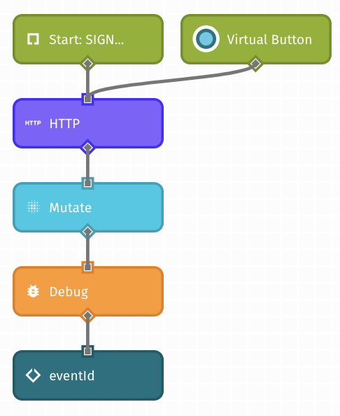
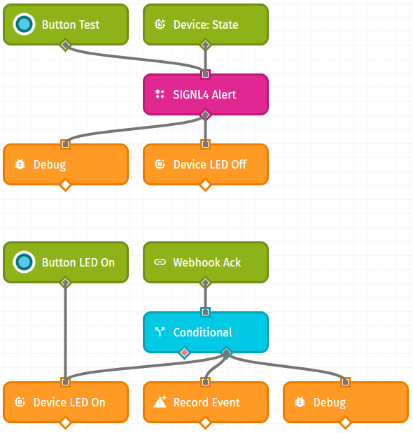
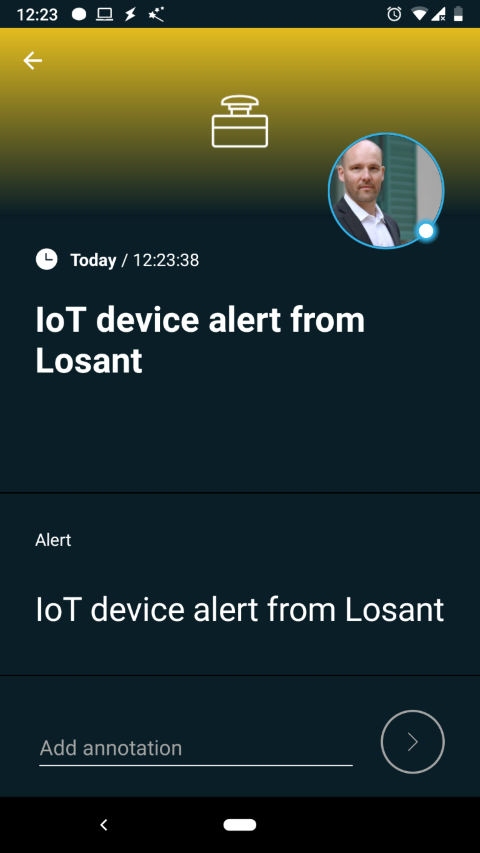

# Integrating SIGNL4 with Losant’s IoT Platform

Gathering events from IoT devices and sending team alerts in case of critical incidents is a broad field. It starts with simple prototypes using a Raspberry Pi and goes up to industrial IoT scenarios, machine data or distributed systems in the field.

SIGNL4 is a mobile alert notification app for powerful alerting, alert management and for mobile assignment of work items. Get the app at https://www.signl4.com.

Losant (https://www.losant.com) offers an easy-to-use and powerful Enterprise IoT Platform designed to help teams quickly build real-time connected solutions. The integration with SIGNL4 is straightforward. In the following we will show an example on how to send alert notifications using SIGNL4 in case of an I/O event happening on a Raspberry Pi.

## Prerequisites

•	A SIGNL4 (https://www.signl4.com) account
•	A Losant (https://www.losant.com) account
•	A Raspberry Pi (optional, you can also do a simulation without it)

## Integration Steps

1. Import the SIGNL4 Custom Node in Losant
In the Losant dashboard go to Workflows -> Custom Nodes and import the SIGNL4 Custom Node. You can find this one at Github (https://github.com/signl4/signl4). The file is called “signl4-alert.node”.

 

2. Prepare the Raspberry Pi (optional)
There is a great description on how to add and configure devices available here: https://docs.losant.com/getting-started/boards/getting-started-with-raspberry-pi.
We have used this sample and you can find our adapted code at Github (https://github.com/signl4/signl4/example). The file is called “index.py”. Please make sure you use your own Device ID, App Access Key and App Access Secret as described in the above article.

3. Create a New Workflow in Losant
Now you can create your own workflow using the device and the SIGNL4 Custom Node as shown below.

The first part of the above workflow is to listen to device events and to send a SIGNL4 alert if such an event occurs. At the same time we switch off the LED connected to the Raspberry Pi.

The second part is optional and gives an idea about how to handle user acknowledgements. In our case we wait for the user acknowledgement and if a user acknowledges the alert we will switch on the LED on the Raspberry Pi again.
In order to pass acknowledgement information from SIGNL4 to Losant you would need to create a webhook in Losant at Weebhooks -> Add webhook. Then in your SIGNL4 portal you would need to add this webhook at Development -> webhooks -> Add. Please note there might be a $ sign at the end of the Losant webhook address. You cannot use this one directly in the SIGNL4 webhook address but you can just encode it a %24.

You can use the buttons to test the work flow. The SIGNL4 Alert node takes two input parameters:
Team Secret: This is the last part of your webhook URL: https://connect.signl4.com/webhook/<teamsecret>.
Alert Message: This is the alert message text to be sent to the team.

The output is the eventId of the transmitted SIGNL4 event.

5. Test It
Now you can test it by using the test button in the workflow or by using the Raspberry Pi device itself. You should then receive the alert in your SIGNL4 app.

That’s it. It is an amazingly simple yet powerful way to show the whole spectrum of IoT alerting from a real device, through an IoT platform towards end-user notifications including acknowledgements.
